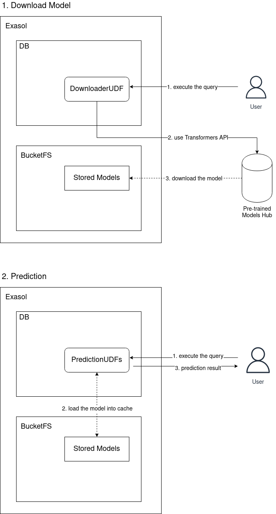

# Design

## Introduction
The Transformers Extension proposes to use large pre-trained models using 
[Transformers API](https://huggingface.co/docs/transformers/index) in Exasol 
Database. These models can be used for many predictive tasks such as text 
classification, question-answering, text generation  etc. in the field of NLP.

## Design Considerations:
Pre-trained models contain many parameters and can reach very large size. 
Therefore, it is not efficient approach to download these large models in 
each predictive task. In order to overcome this challenge, we proposed to 
divide the functionality of this extension into two different parts:

1. Download : It is responsible to download the specified pre-defined model 
into the Exasol BucketFS.
2. Prediction: These are a group of UDFs for each supported task. Each of 
them caches the downloaded pre-trained model and perform prediction. 
These supported tasks:
   1. Sequence Classification for Single Text
   2. Sequence Classification for Text Pair
   3. Question Answering
   4. Masked Language Modelling
   5. Text Generation
   6. Token Classification
   7. Text Translation

## System Design and Architecture

