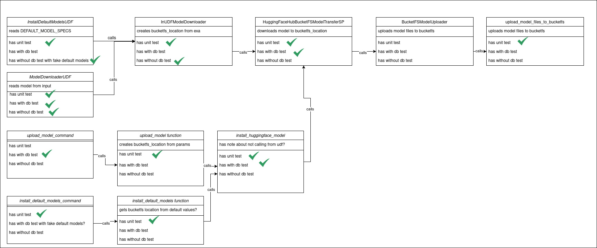

# Developer Guide


In this developer guide we explain how to build this project and how you can add
new transformer tasks and tests.


## Installation
There are two ways to install the Transformers Extension Package:

### 1. Build and install the Python Package
This project needs Python 3.10 or above installed on the development machine.
In addition, in order to build Python packages you need to have the [Poetry](https://python-poetry.org/)
(>= 2.1.0) package manager. Then you can install and build the `transformers-extension` as follows:
```bash
poetry install
poetry build
```

### 2. Download and install the pre-build wheel
Instead of building yourself, the latest version of the Python package of this extension can be downloaded
from the Releases in the GitHub Repository (see [the latest release](https://github.com/exasol/transformers-extension/releases/latest)).
Please download the built archive
`exasol_transformers_extension-<version-number>-py3-none-any.whl`(`transformers_extension.whl` in older versions)
and install it as follows:
```bash
pip install <path/wheel-filename.whl> --extra-index-url https://download.pytorch.org/whl/cpu
```

### Check wheel installation

The wheel should be installed in `transformers-extension/dist`. After updating and building a new release
there may be multiple wheels installed here. This leads to problems, so check and delete the old wheels if necessary.
You may also need to check
`transformers-extension/language_container/exasol_transformers_extension_container/flavor_base/release/dist` for the same reason.

### Run Tests
All unit and integration tests can be run within the Poetry environment created
for the project using nox. See [the nox file](../../noxfile.py) for all tasks run by nox. There are three tasks for tests.

Run unit tests:
```bash
      poetry run -- nox -s test:unit
```
Start a test database and run all integration tests:
```bash
      poetry run -- nox -s start_database
      poetry run -- nox -s test:integration
```
run parts of the integration tests:
```bash
      poetry run -- nox -s onprem_integration_tests
      poetry run -- nox -s saas_integration_tests
      poetry run -- nox -s without_db_integration_tests
```
You can find more information regarding the tests in the [Tests](#tests) section below

## Python Toolbox
We use the Python toolbox, however some things are modified for this project,
mainly because we run our integration tests differently here.

 * we don't use the "slow-checks" workflow for running integration tests, instead we run them in AWS
    * this means code coverage is currently not run on integration tests.
 * we also don't use the "build-and-publish" workflow, because we need to build
    and upload the slc at the moment. instead we use release droid with the
    release_droid_upload_github_release_assets workflow for now.


## Add Transformer Tasks
In the transformers-extension library, the 8 most popular NLP tasks provided by
[Transformers API](https://huggingface.co/docs/transformers/index) have already
been defined. We created separate UDF scripts for each NLP task. You can find
these tasks and UDF script usage details in the [User Guide](../user_guide/invoke_models.md).
This section shows you step by step how to add a new NLP task to this library.

### 1. Add a UDF Template
The new task's UDF template should be added to the `exasol_transformers_extension/resources/templates/`
directory. Please pay attention that the UDF script is uses _"SET UDF"_  and the inputs
are received ordered by pre-determined columns. In addition, the first 4 input
arguments of the UDF script should be:

  - ```device_id```: To run on GPU, specify the valid cuda device ID. Otherwise,
  you can provide NULL for this parameter.
  - ```bucketfs_conn```: The BucketFS connection name
  - ```sub_dir```: The directory where the model is stored in the BucketFS.
  - ```model_name```: The name of the model to use for prediction. You can find the
  details of the models in [huggingface models page](https://huggingface.co/models).

Please note that the output emitted by the UDF is created by adding the model
inference output to the inputs.

### 2. Define UDF Caller
Before implementing the UDF logic (examined in item 4 in this section), the
`run` function responsible for calling the newly created UDF script should be
defined in `exasol_transformers_extension/udfs/callers/`.
Also add the new udf to the lists in tests/utils/db_queries.py

### 3. UDF Template-Caller Matching
The added UDF template and defined UDF caller should be added to the dictionary
in the `exasol_transformers_extension/deployment/constants.py` script. Thus,
we know which template belongs to which script during deployment.

### 4. UDF Script
The UDF script should be a subclass of [BaseModelUDF](../../exasol_transformers_extension/udfs/models/base_model_udf.py).

The UDF class must be defined under the `exasol_transformers_extension/udfs/models/` 
directory.
It should be named in the schema of "Ai<Task>UDF".

Here, you can define settings for transformers , as well as a [TransformationPipeline](../../exasol_transformers_extension/udfs/models/transformation/transformation_pipeline.py).
The `TransformationPipeline` holds a list of `Transformation`s. A transformation is an 
implementation of the [Transformation-Protocol](../../exasol_transformers_extension/udfs/models/transformation/transformation.py). 
They get a DataFrame as input, and transform it in some way. You may also define 
`expected_input_columns`, `new_columns` and `removed_columns` for each `Transformation`.

If none of the existing `Transformation` implementations (see Section 4.1) suit your task, you can write 
your own. More information can be found in Section 4.2.

This `TransformationPipeline` will then be given to the `BaseModelUDF`, which manages 
the data input and output. Here, the 
`TransformationPipeline` will be executed in order.

For a prediction udf you will want one of the `Transformation` to be a
`WithModelTransformation(PredictionTaskTransformation(PredictionTask)`

The PredictionTask is an implementation of the [PredictionTask-Protocol](../../exasol_transformers_extension/udfs/models/prediction_tasks/prediction_task.py). 
It holds the 
logic for a specific NLP-Task. Multiple UDF classes can use the same `PredictionTask`. 
If none of the existing `PredictionTask` implementations (see Section 4.3) suit your task, you can write 
your own. More information can be found in Section 4.4.

The `PredictionTask` get then wrapped in the [PredictionTaskTransformation](../../exasol_transformers_extension/udfs/models/transformation/prediction_task.py) which 
handles calling the `PredictionTask`s functions. Then, the `PredictionTaskTransformation` 
gets wrapped in the [WithModelTransformation](../../exasol_transformers_extension/udfs/models/transformation/with_model_transformation.py) which handles loading the required 
transformers models.

A typical UDF script will look like this:

```python
class Ai<name>UDF(BaseModelUDF):
    def __init__(
        self,
        exa, # the exasol context, comes from the udf caller
        batch_size=100,
        pipeline=transformers.pipeline,
        # defines which types of model the udf will load correctly,
        # depends on the task you want to solve
        base_model=transformers.AutoModelFor<ModelType>,
        tokenizer=transformers.AutoTokenizer,
        # defines the PredictionTask implementation you want to use. 
        # depends on the transformers task-type you want to use.TaskType 
        prediction_task=<TaskType>PredictionTask(...)
    ):
        
        # Define your pipeline here. You might also want to use a 
        # span Transformation or a Default values transformation
        transformations = TransformationPipeline(
            [
                UniqueModelDataframeTransformation(),
                UniqueModelParamsDataframeTransformation(...),
                WithModelTransformation(
                    exa,
                    PredictionTaskTransformation(
                        prediction_task=prediction_task,
                        ...
                    ),
                ),
            ]
        )
        # initialize the super class
        super().__init__(
            batch_size,
            pipeline,
            base_model,
            tokenizer,
            prediction_task=prediction_task,
            transformations=transformations,
        )
```

#### 4.1 Existing Transformations

We have already implemented the following `Transformation`s, 
which you might want to use in your UDF:

 - [UniqueModelDataframeTransformation](../../exasol_transformers_extension/udfs/models/transformation/extract_unique_model_dfs.py) :  Splits the input DataFrame into multiple 
    DataFrames, based on which model is found in the model_name, 
    bucketfs_conn and sub_dir columns.
 - [UniqueModelParamsDataframeTransformation](../../exasol_transformers_extension/udfs/models/transformation/extract_unique_model_param_dfs.py) : Splits the input DataFrame into 
    multiple DataFrames, based on which model-parameters are found. 
    Calls PredictionTask.extract_unique_param_based_dataframes, since the
    model-parameters are tied to the transformers task-type.
 - [PredictionTaskTransformation](../../exasol_transformers_extension/udfs/models/transformation/prediction_task.py) : Calls
        prediction_task.execute_prediction, 
        prediction_task.create_dataframes_from_predictions, 
        prediction_task.append_predictions_to_input_dataframe 
    and returns a DataFrame containing input and  prediction results.
 - [SpanColumnsTokenClassificationTransformation](../../exasol_transformers_extension/udfs/models/transformation/span_columns.py) : Transformation for adding result span 
   columns to the output of the token-classification prediction task.
 - [SpanColumnsZeroShotTransformation](../../exasol_transformers_extension/udfs/models/transformation/span_columns.py) : Transformation for adding result span columns 
   to the output of the zero-shot-classification prediction task.

#### 4.2 Implement a new Transformation

You can add your own implementation of the [Transformation-Protocol](../../exasol_transformers_extension/udfs/models/transformation/transformation.py) if needed, please do so in the
 `exasol_transformers_extension/udfs/models/transformation` 
directory.
Typical `Transformation`s have lists of columns as input, which can be used to ensure 
the output format is correct even in case of an error. 
This is important, since the udf can only emit DataFrames with the correct format.
These lists are typically named `expected_input_columns`, `new_columns` 
and `removed_columns`.

Your new `<YourTransformation>Transformation` class should 
implement the following function:

 - `transform` : holds the logic of the transformation itself.
 - `check_input_format` : Checks if all needed columns for transform are present. 
 - `ensure_output_format` : Ensure all promised output columns are present.

You Might want to use exasol_transformers_extension/udfs/models/transformation/utils
For some common tasks.

#### 4.3 Existing PredictionTasks

We have already implemented the following `PredictionTask`s, 
which you might want to use in your UDF:

 - [FillMaskPredictionTask](../../exasol_transformers_extension/udfs/models/prediction_tasks/fill_mask.py): 
   Task logic for using the "fill-mask" transformers task.
 - [AnswerPredictionTask](../../exasol_transformers_extension/udfs/models/prediction_tasks/question_answering.py) :     
   Task logic for using the "question-answering" transformers task.
 - [EntailmentPredictionTask](../../exasol_transformers_extension/udfs/models/prediction_tasks/text_classification.py) : 
    Task logic for using the "text-classification" transformers task.
    Expects two text inputs per row.
 - [TextClassifyPredictionTask](../../exasol_transformers_extension/udfs/models/prediction_tasks/text_classification.py) :  
    Task logic for using the "text-classification" transformers task in
    a prediction udf.
    Expects one text inputs per row.
 - [TextGenPredictionTask](../../exasol_transformers_extension/udfs/models/prediction_tasks/text_generation.py) : 
   Task logic for using the "text-generation" transformers task.
 - [TokenClassifyPredictionTask](../../exasol_transformers_extension/udfs/models/prediction_tasks/token_classification.py) : 
   Task logic for using the "token-classification" transformers task.
 - [TranslatePredictionTask](../../exasol_transformers_extension/udfs/models/prediction_tasks/translation.py): 
   Task logic for using the "translation" transformers task.
 - [ZeroShotPredictionTask](../../exasol_transformers_extension/udfs/models/prediction_tasks/zero_shot.py) : 
    Task logic for using the "zero-shot-classification" transformers task.

#### 4.4 Implement a new PredictionTask

The `<YourTask>PredictionTask` class, in which we implement the logic of the desired task,
must be defined under the `exasol_transformers_extension/udfs/models/prediction_tasks` 
directory. This class should extend the [PredictionTask-Protocol](../../exasol_transformers_extension/udfs/models/prediction_tasks/prediction_task.py). 
The `PredictionTask` is a Protocol for ensuring the following methods are implemented
and have correct input and output types:

 - `extract_unique_param_based_dataframes` : Even if the data in a given
dataframe all have the same model, there might be differences within the given
dataframe with different model parameters (e.g. _top_k_ parameter in [AIFillMaskExtendedUDF](../../exasol_transformers_extension/udfs/models/ai_fill_mask_extended_udf.py)).
This method is responsible for extracting unique dataframes which share both the
same model and model parameters.
 - `execute_prediction` : Performs prediction on a given text list using
recently loaded models.
- `create_dataframes_from_predictions` : Converts list of predictions to
pandas dataframe.
- `append_predictions_to_input_dataframe`: Reformats the dataframe used in
prediction, such that each input row has a row for each prediction result.

Moreover, Some parameters can be set to manage the (model)output:
* we use `desired_fields_in_prediction` to filter the output of the model.

## Tests

#### 1. Unit Tests
- Unit tests use the [udf-mock-python](https://github.com/exasol/udf-mock-python)
library that tests UDFs locally without a database.
- Different scenarios with  different UDF inputs and different model parameters
are defined under the `test/unit/udf_wrapper_params/` directory.
- These different scenarios are parameterized in the UDF [tests](../../test/unit/udfs).

#### 2. Integration Tests
These tests are grouped into two groups and there are separate tests for each
UDF script in each group:
- `without db` tests the UDF class and functionality that includes the UDF logic.
- `with_db` performs end-to-end test by running the UDF query statements in the database.

The automatic run of the Integration tests on GitHub push are moved into AWS for this repository. They are
only run if you add `[CodeBuild]` to the commit message.
Currently, the CodeBuild project is managed manually and is triggered with a webhook on branch push.
For this our aws-ci user is added to this Repository. The webhook can be configured in the AWS CodeBuild
project directly.
The CodeBuild project also uses our DockerHub user for the build. For this it has access to the AWS SecretsManager.


## Good to know

* Hugging Face models consist of 2 parts, the model and the Tokenizer.
Most of our functions deal with both parts

### Model installers and downloaders

We have multiple scripts and udfs for installing and downloading models:

`InstallDefaultModelsUDF` reads the `DEFAULT_MODEL_SPECS` and installs the default models by calling `InUDFModelDownloader`.

`ModelDownloaderUDF` gets a model as input, installs it by calling `InUDFModelDownloader`.

`InUDFModelDownloader` creates a bucketfs_location from exa and installs a model by calling `HuggingFaceHubBucketFSModelTransferSP`.

`HuggingFaceHubBucketFSModelTransferSP` downloads a model to a temporary directory and then installs the model to the `given bucketfs_model_path` using `BucketFSModelUploader`.

`BucketFSModelUploader` uploads model files to bucketfs using `upload_model_files_to_bucketfs`.

`upload_model_command` calls the `upload_model` function.

`upload_model` function creates a `bucketfs_location` from params and calls `install_huggingface_model`.

`install_huggingface_model` downloads and uploads a model to bucketfs using `HuggingFaceHubBucketFSModelTransfer`.



